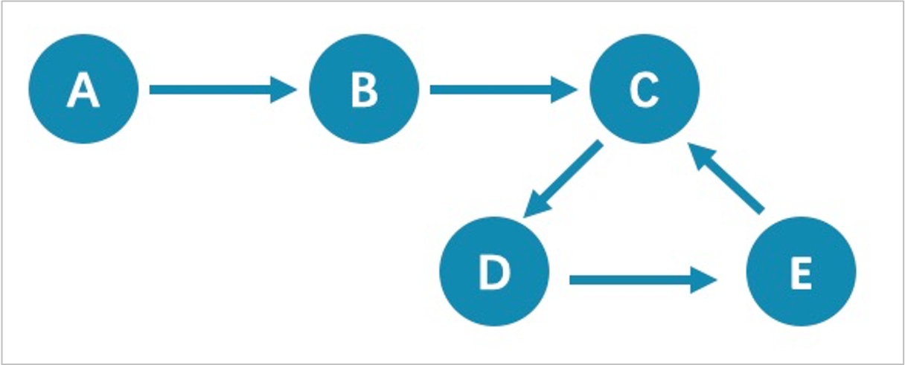

# Path types

In graph theory, a path in a graph is a finite or infinite sequence of edges which joins a sequence of vertices. Paths are fundamental concepts of graph theory.

Paths can be categorized into 3 types: `walk`、`trail`、`path`. For more information, see [wikipedia](https://en.wikipedia.org/wiki/Path_(graph_theory)#Walk,_trail,_path).

The following picture is an example for a brief introduction.

## walk

A `walk` is a finite or infinite sequence of edges. Both vertices and edges can be repeatedly visited in graph traversal.

In the above path graph, C, D, and E form a cycle. So, this path graph contains infinite paths, such as `A->B->C->D->E`, `A->B->C->D->E->C`, and `A->B->C->D->E->C->D`.

!!! note

    `GO` statements use `walk`.

## trail

A `trail` is a finite sequence of edges. Only vertices can be repeatedly visited in graph traversal. The Seven Bridges of Königsberg is a typical `trail`.

In the above path graph, edges cannot be repeatedly visited. So, this path graph contains finite paths. The longest path in this graph consists of 5 edges: `A->B->C->D->E->C`.

!!! note

    `MATCH`, `FIND PATH`, and `GET SUBGRAPH` statements use `trail`.

There are two special cases of trail, `cycle` and `circuit`. The following picture is an example for a brief introduction.

- cycle

   A `cycle` refers to a closed `trail`. Only the terminal vertices can be repeatedly visited. The longest path in this graph consists of 3 edges: `A->B->C->A` or `C->D->E->C`.

- circuit

   A `circuit` refers to a closed `trail`. Edges cannot be repeatedly visited in graph traversal. Apart from the terminal vertices, other vertices can also be repeatedly visited. The longest path in this graph: `A->B->C->D->E->C->A`.

## path

A `path` is a finite sequence of edges. Neither vertices or edges can be repeatedly visited in graph traversal.

So, the above path graph contains finite paths. The longest path in this graph consists of 4 edges: `A->B->C->D->E`.
